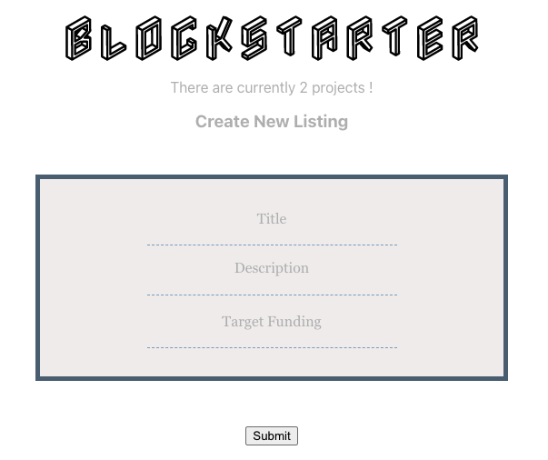
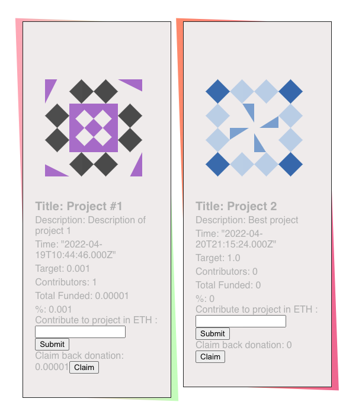

# Blockstarter [](https://app.travis-ci.com/mehdisbys/blockstarter)


This project implements a Kickstarter-like application where people can list projects or causes that need funding and anyone can participate in their funding.

Contributors to a project will be refunded if the deadline is missed anf the target funding is not achieved.

This project runs on the ethereum blockchain and uses: 

- Solidity
- Hardhat
- React
- Chai


The smart contract is tested and test results are available on Travis CI.

Example screenshots : 




### Installation

1. Install NPM packages
   ```sh
   npm install
   ```

2. Run the app
   ```sh
   npm run start

3. Go to http://localhost:3000/


### Redeploy smart contract 

If you ever need to modify the smart contract, you will also need to redeploy it using hardhat.

To deploy to Rinkeby network : 

```sh
npx hardhat run scripts/deploy.js --network rinkeby
```